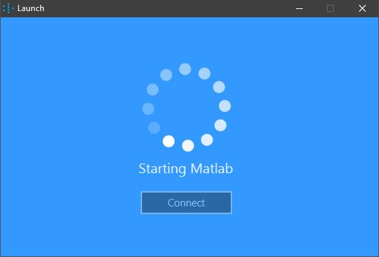
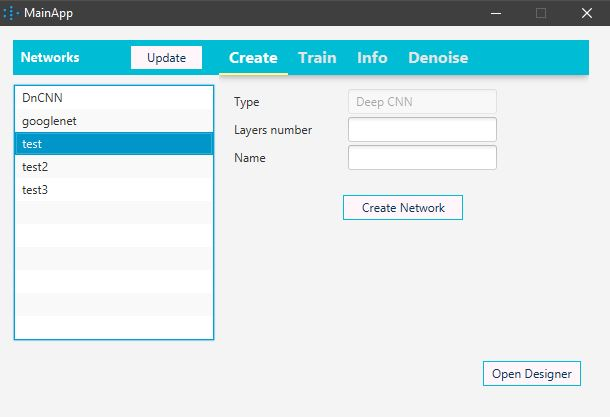

# Denoise Convolution Neural Network Manager  

Simple desktop program on Java & Matlab for creating image denoise networks, training and working with them.

## Getting Started

1. Add link to your Matlab to win64 folder in Path variable (example: D:\Matlab\R2018b\bin\win64\)
2. Copy Java class engine.jar from <Matlab root>extern\engines\java\jar\ to project <project root>\lib\
3. Add this class to your project. On IDEA: File -> Project Structure -> Libraries -> '+' -> Choose engine.jar -> OK
4. Launch class MainApp. You will see start window. Press Connect button and wait:

5. If nothing happens, check 1-3 again. If everything is OK you will see main window:

## Built With

* [Matlab](https://www.mathworks.com/products/matlab.html) - based on Matlab. Need R2017b or higher
* [Deep Learning Toolbox](https://www.mathworks.com/products/deep-learning.html) - tools for neural networks
* [Maven](https://maven.apache.org/) - Dependency Management